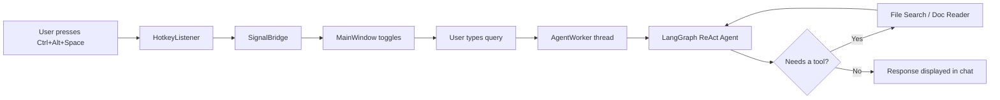

<p align="center">
  <h1 align="center">🤖 Desktop AI Assistant</h1>
  <p align="center">
    A lightweight, privacy-first desktop AI assistant powered by <strong>Ollama</strong> &amp; <strong>LangGraph</strong>.<br/>
    Summon it instantly with a hotkey, ask questions, search files, and summarize documents — all locally.
  </p>
</p>

<p align="center">
  
  
  
  
</p>

---

## ✨ Features

- **🔥 Global Hotkey** — Press `Ctrl + Alt + Space` anywhere to toggle the assistant window
- **🧠 Local AI Agent** — Runs entirely on your machine using [Ollama](https://ollama.ai) (Llama 3.2) — no API keys, no cloud, full privacy
- **📄 Multi-Format Document Reader** — Read and summarize PDFs, Word (.docx), PowerPoint (.pptx), Excel (.xlsx/.xls), and text files
- **🔍 Intelligent File Search** — Search for files across your system by keyword with smart directory aliasing
- **💬 Chat Interface** — Conversational UI with full chat history and context awareness
- **🎨 Modern Dark UI** — Sleek, frameless, translucent window with drag support and drop shadows
- **⚡ Non-Blocking** — Agent runs on a background thread so the UI never freezes
- **🖥️ System Tray** — Runs quietly in the tray; right-click to quit

---

## 🏗️ Architecture

```
Desktop AI Assistant
├── main.py                  # App entry point, system tray, hotkey wiring
├── requirements.txt         # Python dependencies
│
├── agent/
│   ├── core.py              # LangGraph ReAct agent setup (Ollama + tools)
│   └── tools/
│       ├── file_search.py   # File search tool (keyword-based, scored results)
│       └── doc_reader.py    # Universal document reader (PDF, DOCX, PPTX, XLSX, TXT)
│
├── ui/
│   ├── main_window.py       # PyQt6 main window (frameless, dark theme, chat UI)
│   └── worker.py            # QThread worker for async agent invocation
│
└── utils/
    ├── hotkey.py             # Global hotkey listener (pynput)
    └── signal_bridge.py     # Thread-safe Qt signal bridge
```

### How It Works



---

## 🚀 Getting Started

### Prerequisites

| Requirement | Details |
|-------------|---------|
| **Python** | 3.10 or higher |
| **Ollama** | Installed and running locally ([Download](https://ollama.ai)) |
| **Llama 3.2** | Pull the model: `ollama pull llama3.2` |

### Installation

1. **Clone the repository**
   ```bash
   git clone https://github.com/<your-username>/desktop-ai-assistant.git
   cd desktop-ai-assistant
   ```

2. **Create a virtual environment** *(recommended)*
   ```bash
   python -m venv venv

   # Windows
   venv\Scripts\activate

   # macOS / Linux
   source venv/bin/activate
   ```

3. **Install dependencies**
   ```bash
   pip install -r requirements.txt
   ```

4. **Make sure Ollama is running**
   ```bash
   ollama serve
   ```

5. **Launch the assistant**
   ```bash
   python main.py
   ```

---

## 🎮 Usage

| Action | How |
|--------|-----|
| **Toggle window** | `Ctrl + Alt + Space` |
| **Ask a question** | Type in the input field and press `Enter` |
| **Search for files** | *"Find the Amazon JD in my Downloads"* |
| **Summarize a document** | *"Summarize the project report"* |
| **Close window** | Press `Esc` or click ✕ |
| **Quit app** | Type `quit` or `exit`, or right-click tray → Quit |

---

## 📂 Supported File Formats

| Format | Extensions |
|--------|-----------|
| PDF | `.pdf` |
| Microsoft Word | `.docx` |
| Microsoft PowerPoint | `.pptx` |
| Microsoft Excel | `.xlsx`, `.xls` |
| Plain Text | `.txt`, `.md`, `.py`, `.json` |

---

## 🛠️ Tech Stack

| Component | Technology |
|-----------|-----------|
| **AI Model** | [Ollama](https://ollama.ai) — Llama 3.2 (runs locally) |
| **Agent Framework** | [LangGraph](https://github.com/langchain-ai/langgraph) + [LangChain](https://github.com/langchain-ai/langchain) |
| **Desktop UI** | [PyQt6](https://www.riverbankcomputing.com/software/pyqt/) |
| **Hotkey Listener** | [pynput](https://github.com/moses-palmer/pynput) |
| **PDF Parsing** | [PyMuPDF](https://pymupdf.readthedocs.io/) |
| **Office Docs** | [python-docx](https://python-docx.readthedocs.io/), [python-pptx](https://python-pptx.readthedocs.io/) |
| **Spreadsheets** | [pandas](https://pandas.pydata.org/) + [openpyxl](https://openpyxl.readthedocs.io/) |

---

## 🔒 Privacy

This assistant is **100% local**. Your data never leaves your machine:

- The AI model runs via Ollama on your hardware
- File search and document reading happen locally
- No API keys, no cloud services, no telemetry

---

## 📜 License

This project is open source and available under the [MIT License](LICENSE).

---

<p align="center">
  Made with ❤️ and Python
</p>
